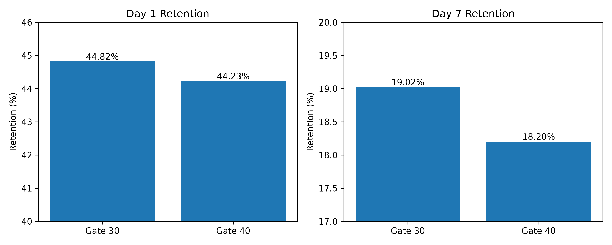

#  Cookie Cats A/B Testing Analysis

Analyzed an A/B experiment on **90,189 mobile game players** to evaluate whether moving the progression gate from **Level 30 to Level 40** improved player retention. The project combines **PostgreSQL, SQL, Python, statistical hypothesis testing, and data visualization** to support data-driven product decisions.


#  Business Problem

Cookie Cats is a popular mobile puzzle game that uses progression gates to encourage players to either wait or make in-app purchases before continuing.

The product team wanted to answer one key question:

> **Does moving the progression gate from Level 30 to Level 40 improve player retention?**

The objective was to determine whether the new gate placement increased long-term player engagement without negatively affecting the user experience.

---

#  Objectives

- Verify that users were randomly assigned between experiment groups.
- Compare Day-1 and Day-7 retention rates.
- Determine whether observed differences were statistically significant.
- Analyze player engagement patterns.
- Provide a business recommendation based on experimental evidence.

---

#  Stakeholders

- Product Managers
- Product Analysts
- Game Designers
- Data Analysts
- Growth Team

---

#  Dataset

**Source:** Cookie Cats A/B Testing Dataset (Kaggle)

### Dataset Overview

| Attribute | Details |
|-----------|---------|
| Total Players | 90,189 |
| Experiment Groups | Gate 30 & Gate 40 |
| Key Features | userid, version, sum_gamerounds, retention_1, retention_7 |

---

#  Tools & Technologies

| Tool | Purpose |
|------|---------|
| PostgreSQL | Data Storage & Querying |
| SQL | Exploratory Analysis |
| Python | Statistical Testing |
| Pandas | Data Analysis |
| Statsmodels | Two-Proportion Z-Test |
| Matplotlib | Data Visualization |
| VS Code | Development Environment |
| Git & GitHub | Version Control |

---

#  Methodology

### Business Understanding

- Defined experiment objective
- Identified success metric (player retention)

### SQL Analysis

- Imported dataset into PostgreSQL
- Explored dataset structure
- Verified randomization balance
- Calculated Day-1 retention
- Calculated Day-7 retention
- Extracted counts for statistical testing

### Statistical Analysis (Python)

Compared retention between experiment groups using a two-proportion z-test to determine whether the observed differences were statistically significant.

### Data Visualization

Built visualizations to compare retention, explore gameplay behavior, and understand how early engagement influenced long-term player retention.

---

#  Key Results

| Metric | Gate 30 | Gate 40 |
|---------|---------|---------|
| Users | 44,700 | 45,489 |
| Day-1 Retention | **44.82%** | **44.23%** |
| Day-7 Retention | **19.02%** | **18.20%** |

---

#  Statistical Findings

### Day-1 Retention

- **P-value:** 0.074
- Difference was **not statistically significant**.

### Day-7 Retention

- **P-value:** ≈ 0.0015
- Difference was **statistically significant**.

---

#  Key Business Insights

- Moving the progression gate to **Level 40 did not improve early retention**.
- **Gate 30 achieved higher Day-7 retention**, indicating better long-term engagement.
- Player activity is highly skewed, with a small percentage of highly engaged users.
- Players completing more game rounds were significantly more likely to return after seven days.

---

#  Business Recommendation

**Recommendation:** Maintain the progression gate at **Level 30**.

### Why?

- No statistically significant improvement in Day-1 retention.
- Statistically significant decrease in Day-7 retention after moving the gate to Level 40.
- Delaying the progression gate reduced long-term player engagement without delivering measurable benefits.

---

## Dashboard


---

#  Additional Visualizations

## Retention Comparison



---

The repository also includes supporting visualizations such as:

- Retention Comparison
- Player Engagement vs. Retention
- Game Rounds Distribution
- Box Plot of Player Activity

These charts are available in the **OUTPUTS** folder.

---

#  Repository Structure

```text
Cookie-Cats-AB-Test
│
├── data
│   └── cookie_cats.csv
│
├── OUTPUTS
│   ├── dashboard.png
│   ├── retention_comparison.png
│   ├── engagement_retention.png
│   ├── histogram.png
│   └── boxplot.png
│
├── PYTHON
│   ├── analysis.py
│   └── advanced_visualizations.py
│
├── SQL
│   └── ab_test_analysis.sql
│
├── requirements.txt
├── .gitignore
└── README.md
```

---

#  How to Run

## 1️ PostgreSQL

- Create a PostgreSQL database.
- Import the Cookie Cats dataset.
- Execute the SQL analysis script.

## 2️ Python

Install the required libraries:

```bash
pip install -r requirements.txt
```

Run the analysis:

```bash
python analysis.py
```

Generate the dashboard:

```bash
python advanced_visualizations.py
```

---

#  Future Improvements

- Bayesian A/B testing
- Confidence interval visualization
- Revenue impact estimation
- Sequential experiment analysis
- Automated stakeholder report generation using LLMs
- Interactive dashboard using Power BI or Tableau

---

#  Skills Demonstrated

### Analytics

- A/B Testing
- Product Analytics
- Statistical Hypothesis Testing
- Confidence Interval Analysis
- Business Decision Making

### Technical

- PostgreSQL
- SQL
- Python
- Pandas
- Statsmodels
- Matplotlib
- Git & GitHub

### Business

- Product Experimentation
- Data Storytelling
- Data Visualization
- Recommendation Writing

---

# Author
PELLAKURU MAHATHI

Computer Science & Business Systems Graduate  
Aspiring Data Analyst | Business Analyst | Product Analyst

If you found this project interesting, feel free to star the repository.

.
