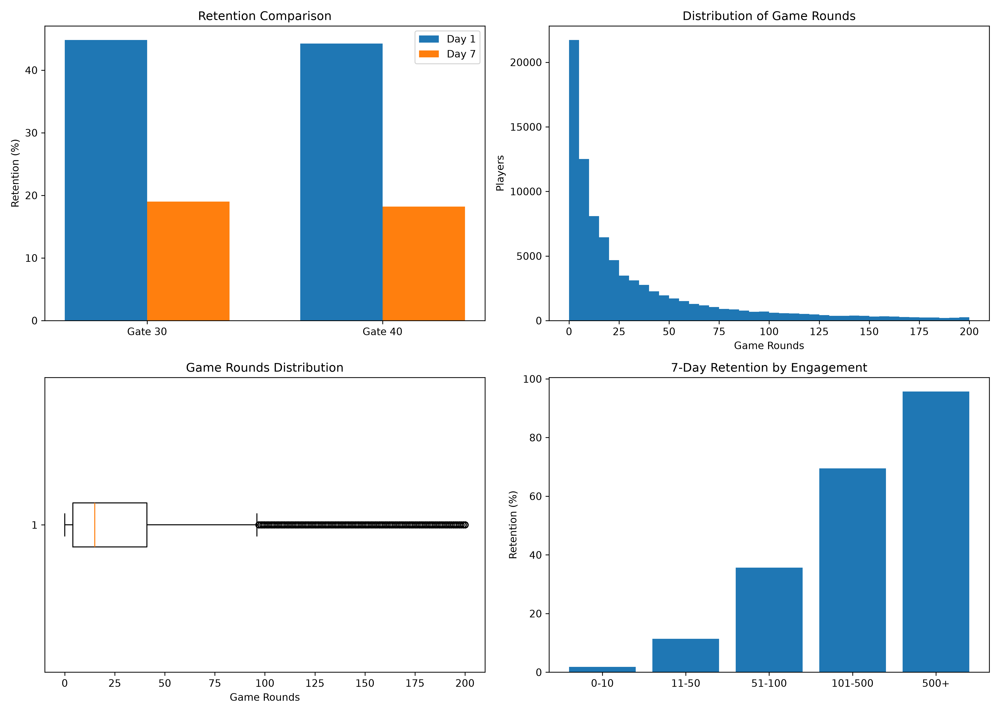

#  Cookie Cats A/B Testing Analysis

Analyzed an A/B experiment on **90,189 mobile game players** to evaluate whether moving the progression gate from **Level 30 to Level 40** improved player retention. The project combines **PostgreSQL, SQL, Python, statistical hypothesis testing, and data visualization** to support data-driven product decisions.

---

## Business Impact

- Evaluated the effect of changing the progression gate on player retention.
- Found that moving the gate to Level 40 reduced seven-day retention.
- Recommended keeping the original gate placement to maximize long-term engagement.

---

## Key Skills

SQL • PostgreSQL • Python • Pandas • Statistics • A/B Testing • Product Analytics • Data Visualization

---

## Business Problem

Progression gates are commonly used in mobile games to control player progression and encourage engagement. The product team wanted to understand whether delaying the gate from Level 30 to Level 40 would improve player retention without negatively affecting the user experience.

---

## Objectives

- Verify random assignment between experiment groups.
- Compare Day 1 and Day 7 retention.
- Test whether the observed differences were statistically significant.
- Explore player engagement patterns.
- Provide a recommendation based on the results.

---

## Stakeholders

- Product Managers
- Product Analysts
- Game Designers
- Growth Team
- Data Analysts

---

## Dataset

**Source:** Cookie Cats A/B Testing Dataset (Kaggle)

| Attribute | Details |
|-----------|---------|
| Players | 90,189 |
| Groups | Gate 30, Gate 40 |
| Key Columns | userid, version, sum_gamerounds, retention_1, retention_7 |

**Note:** The dataset can be downloaded from Kaggle.

---

## Tools Used

| Tool | Purpose |
|------|---------|
| PostgreSQL | Data querying |
| SQL | Exploratory analysis |
| Python | Statistical analysis |
| Pandas | Data manipulation |
| Statsmodels | Two-proportion z-test |
| Matplotlib | Data visualization |
| Git & GitHub | Version control |

---

## Methodology

1. Loaded the dataset into PostgreSQL.
2. Used SQL to explore the data and calculate retention metrics.
3. Extracted experiment counts for statistical testing.
4. Performed two-proportion z-tests in Python.
5. Created visualizations to understand retention and player engagement.
6. Interpreted the results from a product perspective.

---

## Results

| Metric | Gate 30 | Gate 40 |
|---------|---------|---------|
| Players | 44,700 | 45,489 |
| Day 1 Retention | 44.82% | 44.23% |
| Day 7 Retention | 19.02% | 18.20% |

### Statistical Results

| Metric | P-value | Conclusion |
|---------|---------|------------|
| Day 1 Retention | 0.074 | Not statistically significant |
| Day 7 Retention | 0.0015 | Statistically significant |

---

## Key Insights

- Moving the progression gate had no meaningful effect on Day 1 retention.
- Players exposed to the original gate showed higher Day 7 retention.
- Long-term engagement declined after moving the gate to Level 40.
- Players who completed more game rounds were much more likely to return after seven days.

---

## Business Recommendation

Based on the statistical analysis, the progression gate should remain at Level 30. The experiment showed no improvement in early retention and a statistically significant decrease in seven-day retention after moving the gate to Level 40.

---

## Dashboard



Additional charts, including the retention comparison, engagement analysis, histogram, and box plot, are available in the OUTPUTS folder.

---

## Repository Structure

```text
Cookie-Cats-AB-Test/
│
├── data
├── OUTPUTS
├── PYTHON
├── SQL
├── requirements.txt
├── .gitignore
└── README.md
```

---

## How to Run

### SQL

Create a PostgreSQL database and run the SQL analysis script.

### Python

Install the required libraries:

```bash
pip install -r requirements.txt
```

Run:

```bash
python analysis.py
```

Generate the visualizations:

```bash
python advanced_visualizations.py
```

---

## Future Improvements

- Bayesian A/B testing
- Revenue impact estimation
- Interactive dashboards
- Sequential experiment analysis
- Automated reporting

---

## Skills Demonstrated

- A/B Testing
- Product Analytics
- Statistical Analysis
- SQL
- PostgreSQL
- Python
- Pandas
- Data Visualization
- Business Decision Making

---

## Author

**Pellakuru Mahathi**

Computer Science & Business Systems Graduate

Aspiring Data Analyst | Business Analyst
